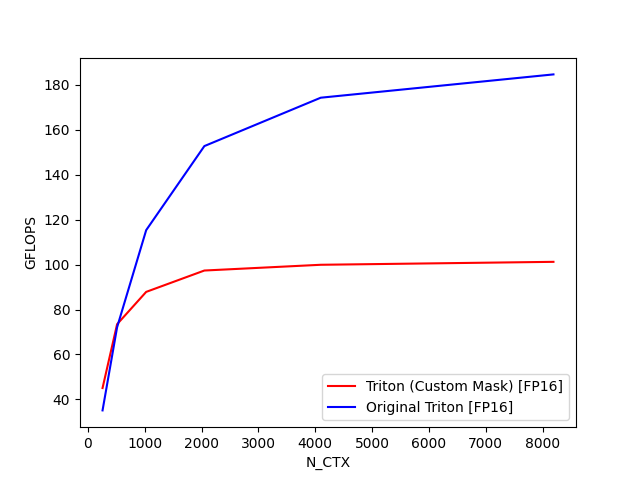
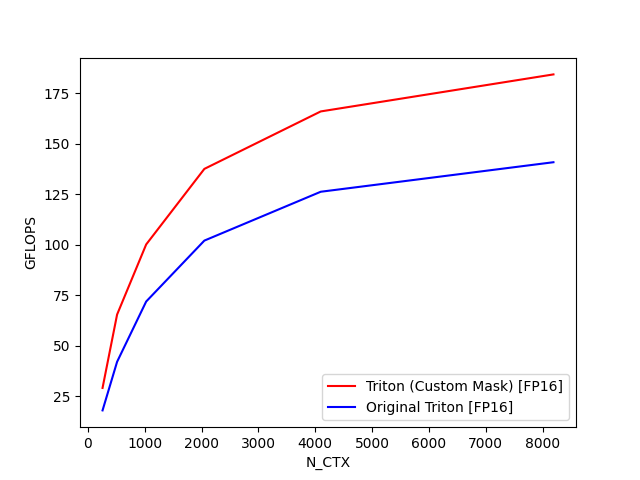
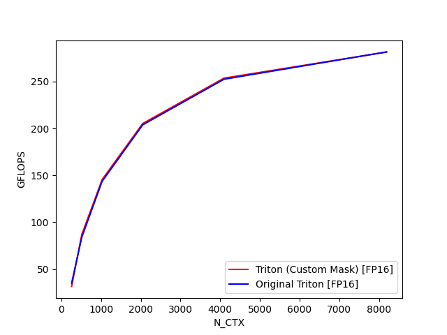

## FlashAttention2 with Custom Masks
For efficiency purposes, the standard implementations of FlashAttention currently do not support **arbitrary custom masks**. 
Their implementation of specific masks like causal masking for language modeling are implemented using branch logic to save
memory. This repository is just a modified version of the tutorial Triton implementation of FlashAttention2 that allows the user
to define a (batch of) custom mask. It modifies both the forward and backwards pass to handle masking.
 
Original Triton code: [https://triton-lang.org/main/getting-started/tutorials/06-fused-attention.html](https://triton-lang.org/main/getting-started/tutorials/06-fused-attention.html)

## Example Setup
The relevant libraries needed to use the custom-mask FlashAttention2 kernel are below:
```
pip install triton
pip install torch
```
Other libraries for evaluating the performance of the models is below. These are primarily for `test_benchmark.py`, which verifies the correctness of the implementation.
```
pip install pytest
pip install matplotlib
pip install pandas
```

## Simple Example
You can insert this module into your standard attention pipeline.
```python
from fa2_custom_mask import flash_attention_custom_mask

B, H, L, D = 1, 16, 4096, 64
fp32_q = torch.randn(B, H, L, D).float().cuda()
fp32_k = torch.randn(B, H, L, D).float().cuda()
fp32_v = torch.randn(B, H, L, D).float().cuda()

out = flash_attention_custom_mask(fp32_q, fp32_k, fp32_v)
...
out.backward(loss)
```

## Benchmarking
Simple benchmark against the base Triton implementation. In our custom mask version, we pass in the canonical causal mask as input (hence storing in global device memory). Running `test_benchmark.py`,
with batch size=4, # heads=32, hidden dim=64, and sequence length `N_CTX`,

#### [Causal Masks] Forward Pass

#### [Causal Masks] Backwards Pass

#### [No Masks] Forward Pass

#### [No Masks] Backwards Pass


## Notes and Bugs
This implementation only works on Ampere devices and up. I originally tried running it on a V100 (Volta) and it failed. 
If time permits, I'm interested in making this implementation generalizable / changing the CUDA implementation for FA3.

